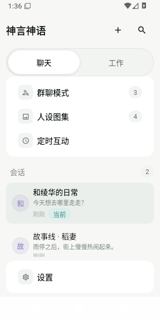
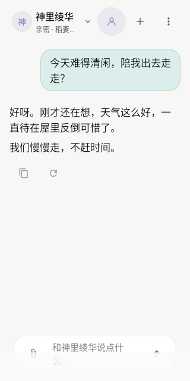
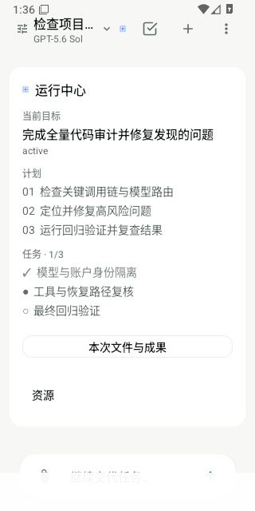
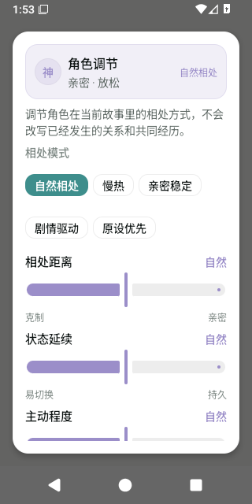
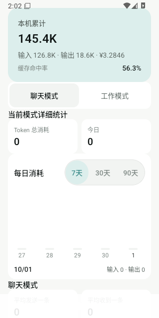

<p align="center">
  
</p>

<h1 align="center">神言神语</h1>

<p align="center">
  一款开源的 Android 端侧 Agent 平台。<b>APK 内自带完整 Harness 内核</b>——<br>
  模型循环、会话、主 / 子代理、持久终端、Node / Python / Git、MCP / LSP、设备能力与聊天人物系统，都在手机上完成编排。
</p>

<p align="center">
  <a href="https://github.com/sy220284/777/actions/workflows/ci.yml"></a>
  <a href="https://github.com/sy220284/777/releases/latest"></a>
  
  
  <a href="LICENSE"></a>
</p>

> **血统与许可**：本仓库 fork 自
> [`sorsama/deepseek-harness-mobile@e5f8c2f`](https://github.com/sorsama/deepseek-harness-mobile/commit/e5f8c2f)
> （DSH Mobile 时代），现以独立应用标识 `com.sy220284.dshmobile` 发行，可与上游同时安装。
> 上游 MIT 许可证与第三方声明完整保留。本机原生 Harness 的官方语义参考由
> `upstream/deepseek-harness.lock.json` 钉定；远程 Web 协议基线独立维护，避免把两条运行链混为一套版本。

---

## 它是什么

神言神语把 **聊天、长期角色互动和真正能执行任务的 Agent** 放进同一个 Android 应用。

你可以把它当普通 AI 聊天工具，也可以让它直接读写文件、运行命令、使用 Git、搜索网页、调用 MCP / LSP、看图片、操作 Android 设备；需要电脑环境时，还能通过 HTTPS 中继连接桌面端 DeepSeek Harness。

它主要有三种使用方式：

1. **聊天模式**：围绕人物设定、关系、共同经历、故事线和长期记忆持续对话，支持群聊、人物调节和定时互动。
2. **工作模式**：Agent 会理解目标、规划步骤、调用真实工具、继续判断并完成任务，也能把工作拆给子代理。
3. **远程模式**：手机作为控制端连接电脑上的 Harness，处理任务、审批、提问和完成通知。

本机模式不要求电脑在线。APK 自带 Node / Python / Git 等执行环境；模型是否联网取决于你配置的模型服务。

## 当前界面

以下图片直接由当前生产界面组件生成，展示现在实际使用的主要页面。

| 导航与会话 | 角色聊天 | 工作执行 |
|:--:|:--:|:--:|
|  |  |  |

| 人物调节 | 模型价格与消耗 |
|:--:|:--:|
|  |  |

## 它是怎么工作的

一次消息进入应用后，大致会经过这条链路：

```text
你输入一句话
↓
判断这是聊天，还是需要真正执行的工作
↓
固定本次使用的模型、账户和协议
↓
Agent 开始思考
├─ 已经能回答 → 直接回复
└─ 需要做事 → 调用工具
               ↓
        文件 / Shell / Git / Web
        Vision / MCP / LSP / Android 设备……
               ↓
          把结果交回模型
               ↓
             继续判断
↓
得到最终结果
↓
保存会话、运行状态、记忆和模型用量
```

聊天模式更重视人物连续性，工作模式更重视任务闭环；两者共用同一套模型路由、工具执行、会话记录和恢复基础。

### 聊天：重点是“持续认识同一个人”

聊天模式会在每次回复前整理当前人物真正需要知道的内容：

```text
人物设定
+ 当前关系
+ 共同经历
+ 当前场景
+ 故事线
+ 最近对话
+ 你刚刚说的话
↓
模型回复
↓
连续性检查
↓
更新人物状态、关系、场景和长期记忆
```

因此人物图集负责“这个人是谁”，故事线和关系记忆负责“你们经历过什么”。

群聊沿用同一套机制：公开事件可以共享，每个角色自己的身份、关系和隐藏状态彼此隔离，避免角色互相串记忆。

### 工作：重点是“把事情做完”

工作模式会让 Agent 持续执行：

```text
理解目标
→ 制定计划
→ 调用工具
→ 查看结果
→ 继续判断
→ 必要时交给子代理并行处理
→ 完成任务
```

它可以读取和修改文件、运行命令、使用 Git、搜索网页、看图片、调用 MCP / LSP、操作 Android 设备，也可以把任务拆给子代理。

长任务会保存运行检查点，包括当前目标、约束、已确认决定、失败尝试、阶段进度和未完成事项。上下文被压缩或应用进程重启后，恢复逻辑会尽量从这些事实继续，而不是只凭一段聊天摘要猜测之前做到哪里。

### 模型：一次任务只认准一次身份

不同模型的接口格式并不相同。应用会先通过统一模型入口确定本次请求实际使用的：

```text
模型档案
→ 账户 / 凭据
→ 模型
→ 接口地址
→ 协议
→ 对应协议适配器
```

当前运行链支持 OpenAI-compatible Chat Completions、OpenAI Responses 和 Anthropic Messages 等协议。

模型既可以使用 API Key，也可以通过 OpenAI 的 **Continue with ChatGPT** 授权连接 ChatGPT 账户并使用符合条件的套餐模型。两种认证身份分别保存和路由，不会互相覆盖。

一次任务开始后，模型档案会固定下来。即使你随后在界面切换到其他模型或账户，已经启动的任务、子代理、Vision 和后续处理仍沿用原来的运行身份，避免串账户、串 API Key 或串上下文。

### 工具：模型负责想，工具负责真的去做

模型提出工具调用后，应用会先检查：

```text
工具是否存在
→ 当前模式是否允许
→ 是否允许修改数据
→ 是否需要用户审批
→ 执行工具
→ 把结果返回模型
```

因此“模型说它做了”与“工具真的执行成功”是两件事。文件修改、命令、设备操作等真实副作用都经过工具执行链；结果未知的危险操作在恢复时不会被盲目重放。

### 会话：聊天记录只是你看到的一层

本机会把用户消息、模型回复、推理过程、工具调用、工具结果、任务步骤、计划和恢复信息写入 Session Event Log。

```text
事件账本
↓
恢复当前会话状态
↓
投影成聊天 / 工作界面
```

所以会话分支、重新生成、修改重发、长历史分页和中断恢复，都建立在同一份事实记录上。界面快照只是为了显示更快，不是另一套独立历史。

### 本机与远程：两条运行链互不混用

**本机模式**：

```text
Android 界面
→ 本机 Agent
→ 模型
→ 本机工具 / MCP / Web / 设备能力
```

核心 Agent 和执行环境都在手机里，模型服务是否联网取决于你的配置。

**远程模式**：

```text
Android 界面
→ HTTPS 中继
→ 电脑上的 DeepSeek Harness
→ 执行
→ 事件返回手机
```

手机负责查看、控制、审批和接收结果；电脑上的 Harness 负责实际远程执行。本机 Agent 与远程协议链保持独立。

### 一句话理解

神言神语把一次普通的“发消息”扩展成：

```text
理解需求
→ 找到正确模型与账户
→ 准备历史、记忆和上下文
→ 推理
→ 必要时调用真实工具
→ 根据结果继续推理
→ 得到结果
→ 保存过程
→ 下次可以继续
```

## 现在能做什么

### 本机执行内核

- 完整 Agent 循环：会话、计划、目标、任务、技能、主代理、子代理、自动任务、并行 / 流水线执行。
- 文件与代码：读取、编辑、搜索、工作区管理、Git、LSP 语言服务器。
- 命令与脚本：持久终端、托管进程、内置 Node / Python / Git，无需 root。
- 外部能力：MCP HTTP / stdio、网页搜索与获取、Vision、Android 设备能力。
- 设备执行：无障碍服务、通知读取、VirtualDisplay，可在隔离虚拟屏中持续完成设备任务。
- 持久恢复：运行 checkpoint、Agent inbox、会话事件账本；恢复时不会自动重放结果未知的危险副作用。

### 聊天模式

- **人物主档案 + 多故事线**：角色、人设、故事、关系与会话绑定分离保存。
- **稳定记忆归属**：人物关系记忆按 Gallery / Persona 身份隔离，避免不同角色之间串记忆。
- **连续性状态**：场景、情绪、关系、未完话题、用户互动习惯与人物变化持续推进。
- **人物行为调节**：亲密距离、状态延续、主动性、表达开放度、人物变化、情绪余韵、互动新鲜度、原设遵循、关系节奏和关系阶段锁定。
- **事实不跟滑杆走**：行为参数只改变表现与变化速度，不会凭参数改写信任、共同经历和关系事实。
- 多角色群聊、主动点名、群关系与群公告。
- 消息修改重发、回复版本切换、重新生成、回复建议与聊天分支。
- 定时互动：人物可按计划主动发起对话。
- AI 味短语硬门禁与重复片段过滤，保持角色表达稳定。

### 工作模式

- 统一任务执行：计划模式、审批、提问、后台任务、工具调用和运行中心共用同一套 Agent 运行链。
- 主代理 / 子代理共享 run checkpoint 与恢复边界，任务可追踪到父子执行关系。
- 发送路径显式区分 **已开始 / 已排队 / 已拒绝**，队列满、会话切换、未配置等原因直接反馈，不再静默丢输入。
- Web、Vision、Automation 和子代理都继承任务归属，便于恢复、日志和消耗分析。

### Token 与可观测性

- 聊天 / 工作模式独立统计，并保留本机累计。
- 按天查看 7 / 30 / 90 天趋势。
- 聊天可查到具体会话，工作可查到具体任务。
- 工作模式区分主代理 / 子代理消耗。
- 单次模型调用带 `requestId / sessionId / turnId / runId / parentRunId / agentId / action`。
- Token 日志可追到回复、状态刷新、回复建议、子代理、Automation、Web、Vision 等动作。
- 本地 Token 总量以成功模型响应实际返回的 API usage 为准；失败、取消、断流或供应商未返回 usage 的请求只记录诊断，不推断供应商最终计费。系统提示词、人物状态、记忆、历史与工具定义只作为输入构成诊断，避免重复统计。
- 旧版本只有累计值的数据继续保留，但不会伪造历史日期、会话或任务归属。

### 通用体验

- 前台服务维持后台执行；完成、审批、提问均有系统通知。
- 会话搜索、轨迹账本、会话导出、消息反馈。
- 浅色 / 深色 / 跟随系统主题、背景图与自适应阅读层。
- 应用内增量更新：带哈希校验的分发链，减少重复下载完整 APK。

## 架构

这是一个 **8 模块 Gradle 工程 + app 内模块化单体**。

Gradle 模块负责真正的二进制 / 平台边界；高频产品能力留在 `app` 中，通过 capability package、窄 Runtime、Projection 和 Coordinator 拆分，避免为了拆文件不断增加 Gradle 配置和 DI 表面积。

### 模块边界

| 模块 | 职责 |
|---|---|
| `app/` | Android 组合根：聊天 / 工作 UI、本机 Harness 编排、远程连接、通知、更新、Webhook |
| `core/` | 纯 JVM 远程协议核心：DTO、RPC、WebSocket mux、重连、事件折叠、通知分类 |
| `harness-core/` | 平台无关 Agent 内核：AgentLoop、工具、任务、资源调度、上下文、事件与插件契约 |
| `harness-runtime-android/` | Android 进程运行时：持久终端、托管进程 |
| `harness-interop/` | MCP HTTP / stdio 与 LSP 互通 |
| `harness-device-android/` | Android 设备能力：无障碍、通知、虚拟屏 |
| `mock-harness/` | Ktor Harness 模拟服务端，用于协议和行为测试 |
| `reference-validation/` | 官方 Harness 黄金结果与原生一致性验证 |

依赖保持单向：

```text
app
├─ harness-device-android
├─ harness-interop
├─ harness-runtime-android
└─ harness-core

core   ← 远程 Harness 协议链，和本机 Agent 内核保持独立
```

### app 内能力架构

本机 UI 不再直接把所有能力压到一个 Engine 上。

```text
Compose UI / ViewModels
        │
        ▼
presentation
  ├─ LocalUiRuntime
  ├─ Chat / Work Surface Projection
  └─ Settings / Task Projection
        │
        ▼
capability runtimes
  ├─ local.chat
  ├─ local.work
  ├─ local.session
  ├─ local.model
  ├─ local.tools
  ├─ local.automation
  └─ local.usage
        │
        ▼
LocalHarnessEngine
  只负责跨能力回合一致性与编排
        │
        ▼
Coordinators / Stores / Repositories
        │
        ▼
harness-core / Android runtime / MCP / device
```

几个关键边界：

- **UI 状态投影**：Chat 与 Work 从同一运行态投影出各自的 `LocalConversationSurfaceState`，另一模式的状态保持稳定默认值；`distinctUntilChanged` 避免无关状态唤醒 UI。
- **流式输出独立**：高频 streaming preview 不反复重写完整 aggregate state，降低 Compose 热路径更新成本。
- **发送协调**：`LocalSendCoordinator` 统一处理启动、排队和拒绝，避免 UI 与 Engine 各自维护一套发送规则。
- **运行上下文**：`LocalAgentRunCoordinator` 为前台、子代理、Automation 建立统一 checkpoint；未知副作用不会在恢复时盲目重试。
- **插件组合**：Android / MCP / Vision 等平台能力由 `LocalPluginCompositionFactory` 组装，Engine 不直接持有 PluginRegistry。
- **Token 可观测**：`TokenUsageAnalyticsStore` 记录请求级账本，`LocalTokenUsageContextBridge` 把 Web / Vision 等内部调用重新归属到触发它们的任务。
- **聊天记忆**：人物关系记忆有稳定 subject key；人物连续性、关系证据和行为调节分别处理，避免“调参数 = 改历史事实”。
- **历史与性能**：会话事件采用追加式账本、分页与有界 transcript window；热路径禁止重新物化整个历史。

`LocalHarnessEngine`、`LocalHarnessScreen`、`SessionStore` 等热点文件受 CI 行数与职责 ratchet 约束：新功能必须优先向独立能力边界下沉。

## 验证体系

本机内核不是“照着文档抄”，而是**对着官方实现逐项比对**：

1. **钉版**——`upstream/deepseek-harness.lock.json` 锁定官方 commit，避免语义基准漂移。
2. **黄金结果**——`tools/capture/` 对锁定版本运行真实行为并录制一致性夹具。
3. **原生比对**——`reference-validation` 用同一输入驱动 Android 本机实现，与黄金结果比对。
4. **模拟对手**——`mock-harness` 提供常驻 Ktor 测试服务端。
5. **CI 门禁**——先按改动性质分配验证范围；产品 / 构建 / Runtime 变更执行架构、性能、UI、Kotlin、单元测试、Harness、Lint、optimized APK 与 Android 16 / 17 完整验证，文档、自动化和测试-only 改动只运行对应检查，最终统一由 merge-gate 放行。

除了“测试通过”，仓库还对热点文件大小、热路径实现、会话分页、流式输出、工具边界、恢复语义等设置了 ratchet。新增功能不能靠把责任重新塞回核心文件通过。

当前验证闭环见 [VALIDATION.md](docs/VALIDATION.md)，本机 Harness 实现边界见
[Android 原生 Harness 当前状态](docs/ANDROID-HARNESS-STATUS.zh-CN.md)。

## 环境要求

- Android 16+（minSdk 36，targetSdk 36，compileSdk 37）。
- 默认内置运行时按 `arm64-v8a` 打包。
- 模拟器 / x86_64 设备可用 `DSH_RUNTIME_ABIS=x86_64` 自行构建。
- 远程模式需运行 [DeepSeek Harness](https://github.com/deepseek-ai/deepseek-harness)，协议基线与兼容说明见 [docs/COMPATIBILITY.md](docs/COMPATIBILITY.md)。

## 快速开始

1. 从 [Releases](https://github.com/sy220284/777/releases/latest) 安装 APK。
2. **本机模式**：进入模型设置后，可配置 API Key，或通过 **Continue with ChatGPT** 连接 ChatGPT 账户并使用符合条件的套餐模型；选择模型后即可开始。API Key 使用 Android Keystore 加密存储。
3. **远程模式**：在电脑上安装 [`dsh-relay`](https://github.com/sorsama/deepseek-harness-relay)：

   ```sh
   dsh plugin --profile web add dsh-relay
   dsh web
   ```

   打开打印的 URL 设置密码，进入 `/relay/pair`；在应用里 **中继 → 配对中继** 扫码。
   远程访问只支持配对后的 HTTPS 中继。

## 安全与边界

- API 密钥由 Android Keystore 加密。
- 写文件、编辑文件、执行高风险命令受审批和能力边界约束。
- 本机文件工具受规范化路径边界约束：包含应用私有工作区与获准的用户共享存储根目录。Shell 以工作区作为默认目录，可执行应用权限允许的命令；Webhook 只监听回环地址。
- 远程访问要求配对 HTTPS 中继，详见 [docs/SECURITY.md](docs/SECURITY.md)。
- Agent 可以实际执行文件、命令与设备操作；请只启用你理解并信任的能力。

## 构建

```sh
./gradlew :app:assembleDebug
./gradlew :app:assembleRelease
```

工具链：

- AGP 9.4.0
- Kotlin 2.2.10
- Jetpack Compose BOM 2026.09.00
- Hilt 2.59.2
- Java 17

当前正式版本以 GitHub Releases 的最新标签为准。

发布版本号来自 git 标签：发布工作流导出 `DSH_VERSION_NAME`，`versionCode` 由版本名推导；本地构建回退到 `.github/release-version`。该 fallback 随主线准备的下一正式版推进，避免本地升级测试使用陈旧 versionCode。

开发与合并规则见 [AGENTS.md](AGENTS.md)，贡献流程见 [CONTRIBUTING.md](CONTRIBUTING.md)。

## 文档

- [文档入口](docs/README.md)
- [架构](docs/ARCHITECTURE.md) · [协议](docs/PROTOCOL.md) · [兼容性](docs/COMPATIBILITY.md) · [安全](docs/SECURITY.md)
- [Android 原生 Harness 当前状态](docs/ANDROID-HARNESS-STATUS.zh-CN.md) · [后续路线](docs/ANDROID-HARNESS-ROADMAP.zh-CN.md)
- [验证体系](docs/VALIDATION.md) · [UI / UX](docs/UI-UX.zh-CN.md) · [效果图](docs/UI-ARTIFACTS.md)

## 许可证

[MIT](LICENSE)。第三方材料见 [THIRD_PARTY_NOTICES.md](THIRD_PARTY_NOTICES.md)。

DeepSeek Harness 及其品牌归各自所有者所有；本项目是独立的社区构建，并已沿自己的产品与架构路径持续演化。
