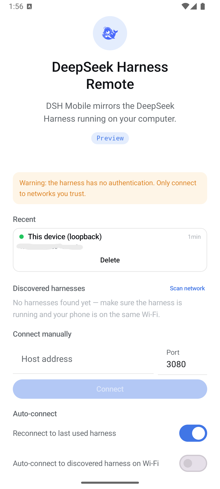
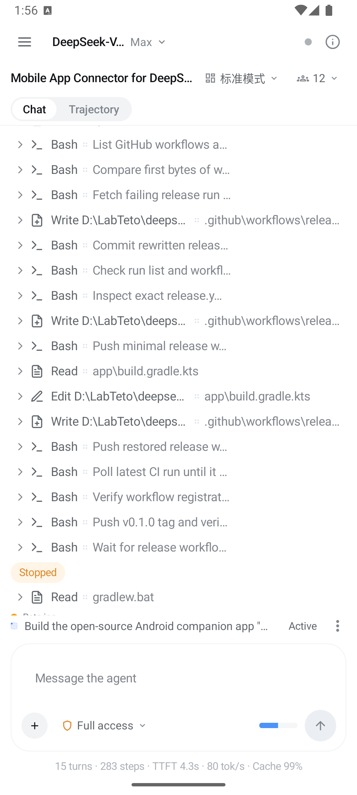
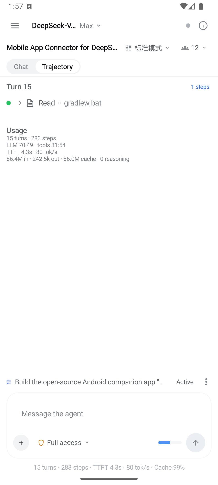
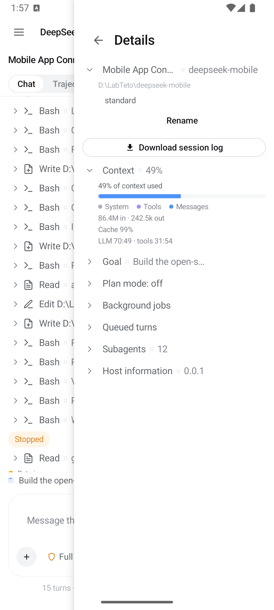
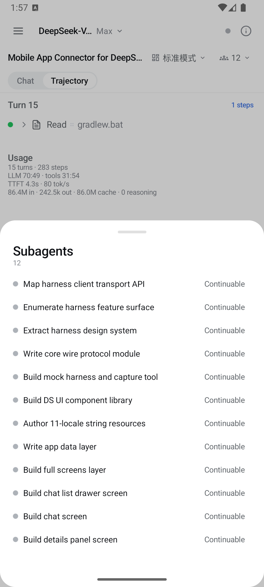

<p align="center">
  
</p>

<h1 align="center">DSH Mobile — รีโมตสำหรับ DeepSeek Harness</h1>

<p align="center">
  แอปคู่หูโอเพนซอร์สบน Android ที่ย้าย <b>DeepSeek Harness</b> ของคุณมาไว้ในกระเป๋า<br>
  สั่งงานเซสชัน ดูแผนและเป้าหมาย ตอบคำขออนุมัติและคำถาม
  และรับการแจ้งเตือนเมื่อ harness ทำงานเสร็จ — จากมือถือของคุณ ผ่านเครือข่ายภายในบ้าน
</p>

<p align="center">
  <a href="https://dshm.zyphite.com"></a>
  <a href="https://github.com/sorsama/deepseek-harness-mobile/releases/latest"></a>
  <a href="https://github.com/sorsama/deepseek-harness-mobile/actions/workflows/ci.yml"></a>
  
  <a href="LICENSE"></a>
</p>

<p align="center">
  <a href="README.md">English</a> ·
  <a href="README.zh-CN.md">中文</a> ·
  <a href="README.hi.md">हिन्दी</a> ·
  <a href="README.es.md">Español</a> ·
  <a href="README.fr.md">Français</a> ·
  <b>ไทย</b>
</p>

DSH Mobile เป็น **แอปคู่หูที่ไม่ใช่ของทางการ** สำหรับ
[DeepSeek Harness](https://github.com/deepseek-ai/deepseek-harness) (MIT)
ทำหน้าที่จำลอง GUI บนเว็บของ harness ให้ครบทุกฟีเจอร์ ด้วยภาษาการออกแบบเดียวกับ harness เอง
รองรับเฉพาะ Android เขียนด้วย Kotlin + Jetpack Compose

คู่หูอีกฝั่งหนึ่งคือ [**dsh-relay**](https://github.com/sorsama/deepseek-harness-relay) —
ปลั๊กอินของ harness ที่เติมชั้นการยืนยันตัวตนซึ่ง harness เองยอมรับว่าไม่มี
เพื่อให้แอปนี้เข้าถึง harness ด้วยข้อมูลรับรองจริงและกุญแจที่ปักหมุดไว้ แทนที่จะเป็นพอร์ตที่เปิดโล่ง
ดูเพิ่มที่ [Relay](https://github.com/sorsama/deepseek-harness-mobile/wiki/Relay)

**[dshm.zyphite.com](https://dshm.zyphite.com)** คือเว็บไซต์ของโปรเจกต์ — บอกว่าแอปนี้คืออะไร
หน้าตาเป็นอย่างไร และเริ่มใช้งานอย่างไร จบในหน้าเดียว

[**wiki**](https://github.com/sorsama/deepseek-harness-mobile/wiki) คือคู่มือสำหรับผู้ใช้:
[เริ่มต้นใช้งาน](https://github.com/sorsama/deepseek-harness-mobile/wiki/Getting-Started),
[การเชื่อมต่อ](https://github.com/sorsama/deepseek-harness-mobile/wiki/Connecting),
[การแก้ปัญหา](https://github.com/sorsama/deepseek-harness-mobile/wiki/Troubleshooting),
[ทัวร์ฟีเจอร์](https://github.com/sorsama/deepseek-harness-mobile/wiki/Feature-Tour) และ
[คำถามที่พบบ่อย](https://github.com/sorsama/deepseek-harness-mobile/wiki/FAQ)

---

## ภาพหน้าจอ

| เชื่อมต่อ | แชท | เส้นทาง |
|:--:|:--:|:--:|
|  |  |  |
| harness ที่ใช้ล่าสุดพร้อมสถานะการเข้าถึงแบบเรียลไทม์, ค้นหาใน LAN, กรอก `host:port` เอง, เชื่อมต่ออัตโนมัติ | เทิร์นที่สตรีมแบบเรียลไทม์, สัญลักษณ์ประจำเครื่องมือแต่ละตัว, การ์ดเครื่องมือที่กางดูได้, ตัวเลือกสิทธิ์ | เซสชันเดียวกันในรูปบัญชีรายการแยกตามเทิร์น พร้อมยอดรวมการใช้งาน |

| รายละเอียดเซสชัน | ซับเอเจนต์ |
|:--:|:--:|
|  |  |
| สัดส่วนคอนเท็กซ์, เป้าหมาย, โหมดวางแผน, งานเบื้องหลัง, เทิร์นที่รอในคิว, ข้อมูลโฮสต์, ส่งออกบันทึกเซสชัน | รายการซับเอเจนต์ — เปิดดูบทสนทนาของซับเอเจนต์ ถามต่อ หรือสั่งหยุดกลางคัน |

## ฟีเจอร์

- **เชื่อมต่อง่าย** — ค้นหา harness บน Wi-Fi ให้อัตโนมัติ (สแกนซับเน็ตแบบแอ็กทีฟ +
  จับมือยืนยันความพร้อม), จำโฮสต์ที่เคยใช้และตรวจสถานะให้ตั้งแต่เปิดแอป, กรอก `host:port` เองได้,
  รองรับ loopback สำหรับการรันบนเครื่องเดียวกัน และมีสวิตช์เชื่อมต่ออัตโนมัติ
  (ตัวที่ใช้ล่าสุด / LAN / เครื่องเดียวกัน)
- **การนำทางสไตล์ Discord** — ปัดจากขอบซ้ายไปทางขวาเพื่อเปิดรายการแชทที่จัดกลุ่มตามเวิร์กสเปซ
  ปัดไปทางซ้ายเพื่อปิด และปัดจากขอบขวาไปทางซ้ายเพื่อเปิดแผงรายละเอียดเซสชัน
- **ประสบการณ์แชทครบถ้วน** — เทิร์นที่สตรีมแบบเรียลไทม์พร้อมกางดูการให้เหตุผล, markdown,
  การ์ดเครื่องมือแบบเทอร์มินัล/diff/อ่านไฟล์/ค้นหา/เว็บ, แถบคิว (แก้ไข / ลบ / ปรับทิศทาง),
  โหลดประวัติเป็นหน้า ๆ, แนบรูปภาพและไฟล์
- **สแลชคอมมานด์และสกิล** — ช่องพิมพ์จะตรวจบรรทัดที่ขึ้นต้นด้วย `/` เทียบกับรายการคำสั่งของเซสชันนั้น
  แล้วส่งให้เกตเวย์คำสั่งของ harness ทำงาน ส่วนบรรทัดที่ไม่ตรงกับรายการคำสั่งใดจะถูกส่งเป็นพรอมป์ต
  ซึ่งเป็นวิธีเรียกใช้สกิล
- **ทำได้ทุกอย่างเท่าที่ GUI ทำได้** — เป้าหมาย (เฟส, รอบ, หยุด/ทำต่อ/แก้ไข), โหมดวางแผนและการตรวจแผน,
  การอนุมัติสิทธิ์, คำถามถึงผู้ใช้, แถบสิ่งที่ต้องทำ, ซับเอเจนต์ (รายการ, ถามต่อ, สั่งหยุด),
  งานเบื้องหลัง, การรันเวิร์กโฟลว์, สกิล, การเลือกโมเดล, พรีเซ็ตเอเจนต์, ค้นหาในเซสชัน,
  บัญชีรายการเส้นทาง, ส่งออกเซสชัน, ให้ฟีดแบ็กกับข้อความ
- **การแจ้งเตือน** — เทิร์นเสร็จแล้ว, เป้าหมายสำเร็จ / ติดขัด, มีการตรวจสอบหรือคำถามรออยู่;
  คงการเชื่อมต่อเบื้องหลังด้วย foreground service
- **หน้าตาเหมือน harness** — ใช้ดีไซน์โทเคนของ DeepSeek Harness ตรงตัว (สี, ตัวอักษร, ความโค้งมุม,
  แถวแบบกางดูได้, เอฟเฟกต์ shimmer, ปุ่มหมึก) พร้อมธีมสว่าง / มืด / ตามระบบ
- **11 ภาษา** — English, 中文, हिन्दी, Español, Français, العربية, বাংলা, Português, Русский,
  اردو, ไทย (รองรับภาษาที่เขียนขวาไปซ้าย)

## ความต้องการของระบบ

- Android 8.0 ขึ้นไป (minSdk 26)
- มี [DeepSeek Harness](https://github.com/deepseek-ai/deepseek-harness) ที่กำลังรันอยู่
  (ทดสอบกับเวอร์ชัน `0.1.3-alpha.1`) **0.10.0 ต้องใช้ฮาร์เนส 0.1.3** — รุ่นนั้น
  เลิกบันทึกชิ้นส่วนของคำตอบลงล็อก แล้วย้ายไปส่งผ่านสตรีมสดที่แอปต้องขอเอง ดังนั้นแอปกับ
  ฮาร์เนสต้องอัปเดตพร้อมกัน: แอปรุ่นเก่าจะไม่เห็นคำตอบที่กำลังพิมพ์บน 0.1.3 และแอปรุ่นนี้
  ใช้คำสั่ง slash บน 0.1.2 ไม่ได้ ดู [docs/COMPATIBILITY.md](docs/COMPATIBILITY.md)

## เริ่มใช้งานอย่างรวดเร็ว

1. ติดตั้ง APK ล่าสุดจาก
   [Releases](https://github.com/sorsama/deepseek-harness-mobile/releases/latest)
2. เปิดแอปแล้วเลือกวิธีเชื่อมต่อ ทั้งหมดนี้ไม่ใช่ตัวเลือกย่อยของการตั้งค่าเดียวกัน —
   ให้เลือกอันที่ตรงกับสิ่งที่คุณตั้งไว้บนเครื่องคอมพิวเตอร์

   **รีเลย์** — เข้ารหัส ยืนยันตัวตน และใช้งานจากนอกวง Wi-Fi ได้ ติดตั้ง
   [`dsh-relay`](https://github.com/sorsama/deepseek-harness-relay) ลงในโปรไฟล์ web ของ harness:

   ```sh
   dsh plugin --profile web add dsh-relay
   dsh web
   ```

   เปิด URL ที่พิมพ์ออกมา **บนเครื่องนั้น** ตั้งรหัสผ่าน แล้วเปิด `/relay/pair`
   ในแอปให้ไปที่ **รีเลย์ → จับคู่รีเลย์** แล้วสแกน QR เมื่อทุกเครื่องที่คุณใช้จับคู่ครบแล้ว
   ให้ปิด `compat.addressGrants` ของรีเลย์เสีย — ที่นี่ไม่มีอะไรต้องใช้มันแล้ว

   **เครือข่ายภายใน** — ไม่ต้องตั้งค่าอะไรบนมือถือ และไม่มีการยืนยันตัวตนเลย ให้ใส่แพตช์ LAN
   ไฟล์เดียวตามที่อธิบายไว้ใน [`harness/README.md`](harness/README.md) แล้วรีสตาร์ท `dsh web`
   จากนั้นแตะ **สแกนเครือข่าย** ใช้เฉพาะบนเครือข่ายที่คุณไว้ใจเท่านั้น

   **ผ่านรีเวิร์สพร็อกซี HTTPS ของคุณเอง** — วางที่อยู่ `https://` ลงในโหมดเครือข่ายภายใน
   พร็อกซีสามารถส่งต่อไปยัง loopback ได้ harness จึงไม่ต้องแพตช์ แต่มันแค่เข้ารหัสการเชื่อมต่อ
   โดยไม่ได้ยืนยันตัวตนของใครเลย ดู [`harness/README.md`](harness/README.md)

   **USB / อีมูเลเตอร์** — รัน `dsh web` แล้วตามด้วย `adb reverse tcp:3080 tcp:3080`
   จากนั้นเชื่อมต่อไปที่ `127.0.0.1:3080` ในโหมดเครือข่ายภายใน ไม่ต้องใส่แพตช์
3. เลือกเซสชัน เริ่มแชท แล้วรอรับการแจ้งเตือนเมื่อ harness ทำงานเสร็จ

ถ้าเชื่อมต่อไม่สำเร็จ แอปจะบอกสาเหตุให้ตรง ๆ และหน้า
[การแก้ปัญหา](https://github.com/sorsama/deepseek-harness-mobile/wiki/Troubleshooting)
ใน wiki ก็เรียงตามประโยคนั้นพอดี

## ความเข้ากันได้และความปลอดภัย

> **0.1.2:** ตั้งแต่ฮาร์เนส 0.1.2 ฮาร์เนสจะยืนยันตัวตนทั้ง API: วางลิงก์ที่ฮาร์เนสแสดงตอนเริ่มทำงานหนึ่งครั้งเมื่อแอปถาม ลิงก์นี้ยืนยันตัวตนของโทรศัพท์ แต่ไม่ได้เข้ารหัสการเชื่อมต่อ จึงยังควรใช้เฉพาะบนเครือข่ายที่ไว้ใจได้

- ดูตารางเวอร์ชันของ harness และส่วนที่ใช้ได้เฉพาะผ่าน loopback ได้ที่
  [docs/COMPATIBILITY.md](docs/COMPATIBILITY.md)
- **อ่าน [docs/SECURITY.md](docs/SECURITY.md) ก่อน** — harness เปล่า ๆ ไม่มีระบบยืนยันตัวตนใด ๆ
  โหมดเครือข่ายภายในจึงเหมาะกับเครือข่ายที่ไว้ใจได้เท่านั้น ด้วยเหตุผลเดียวกันนี้
  แอปจึงเตือนไว้บนหน้าจอเชื่อมต่อด้วย ส่วนโหมดรีเลย์เพิ่มข้อมูลรับรองจริงและใบรับรองที่ปักหมุดไว้
  แต่ถึงยืนยันตัวตนผ่านแล้ว สิทธิ์ที่ได้ก็เท่ากับการเปิด shell บนเครื่องนั้น
  เพราะเอเจนต์รันคำสั่งอยู่ที่นั่น

## การบิลด์

```sh
./gradlew :app:assembleDebug      # APK สำหรับดีบัก
./gradlew :app:assembleRelease    # APK สำหรับปล่อยจริง (จะเซ็นให้เมื่อตั้งค่า keystore ไว้ในตัวแปรสภาพแวดล้อม)
```

เลขเวอร์ชันที่ปล่อยออกมาจะมาจาก git tag: เวิร์กโฟลว์ปล่อยรุ่นจะส่งออก `DSH_VERSION_NAME`
จากชื่อแท็ก และ `versionCode` ก็คำนวณต่อจากค่านั้น ส่วนการบิลด์ในเครื่องจะถอยไปใช้ค่าที่เขียนไว้ตรง ๆ
ใน `app/build.gradle.kts`

ดูรอบการพัฒนากับ harness ตัวจริง โครงสร้างโมดูล และเวิร์กโฟลว์การปล่อยรุ่นได้ที่
[CONTRIBUTING.md](CONTRIBUTING.md)

## โครงสร้างที่เก็บโค้ด

| พาธ | คืออะไร |
|---|---|
| `core/` | แกนโปรโตคอล JVM ล้วน: DTO ของโปรโตคอล, RPC client, ดาวน์ลิงก์ WebSocket, ลูปเชื่อมต่อใหม่, การพับเซสชัน, ตัวจำแนกการแจ้งเตือน |
| `app/` | UI ฝั่ง Android: หน้าจอต่าง ๆ, การค้นหา/เชื่อมต่อ, foreground service, การแจ้งเตือน, i18n |
| `mock-harness/` | ตัวจำลองเซิร์ฟเวอร์ `/api` ของ harness ด้วย Ktor สำหรับใช้ในเทสต์ |
| `tools/capture/` | บันทึกทราฟฟิกจาก harness ตัวจริงไว้เป็น fixture สำหรับทดสอบความสอดคล้อง |
| `harness/` | แพตช์คู่หูและคู่มือสำหรับโหมด LAN |
| — | ตัวรีเลย์เองอยู่ที่ [sorsama/deepseek-harness-relay](https://github.com/sorsama/deepseek-harness-relay) |
| `docs/` | [สถาปัตยกรรม](docs/ARCHITECTURE.md), [บันทึกโปรโตคอล](docs/PROTOCOL.md), [ความเข้ากันได้](docs/COMPATIBILITY.md), [ความปลอดภัย](docs/SECURITY.md) |

## สัญญาอนุญาต

[MIT](LICENSE) รายการซอฟต์แวร์ของบุคคลที่สามที่รวมมาอยู่ใน
[THIRD_PARTY_NOTICES.md](THIRD_PARTY_NOTICES.md) ส่วน DeepSeek Harness และแบรนด์ของมัน
เป็นทรัพย์สินของเจ้าของที่เกี่ยวข้อง โปรเจกต์นี้เป็นรีโมตอิสระที่ชุมชนสร้างขึ้นเอง
