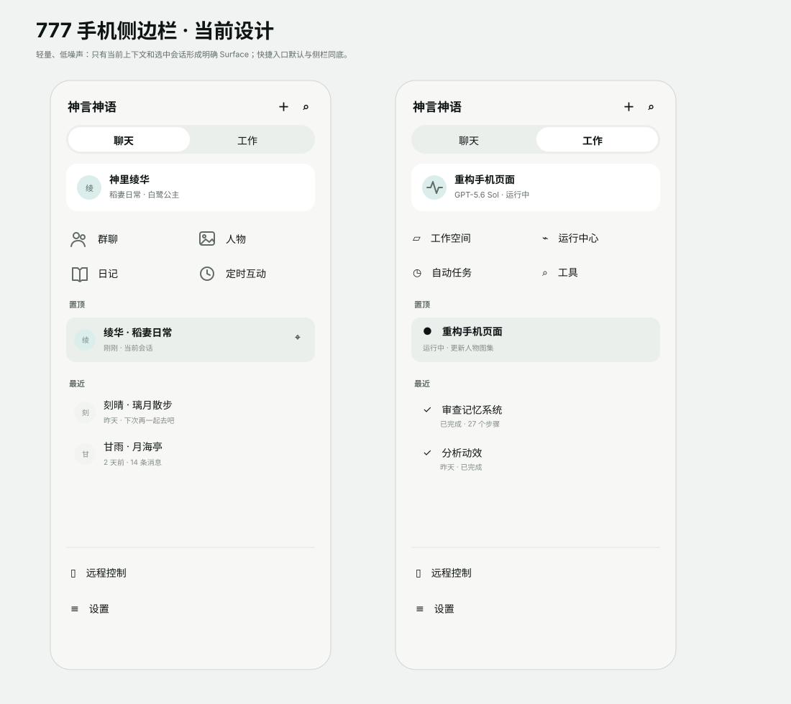
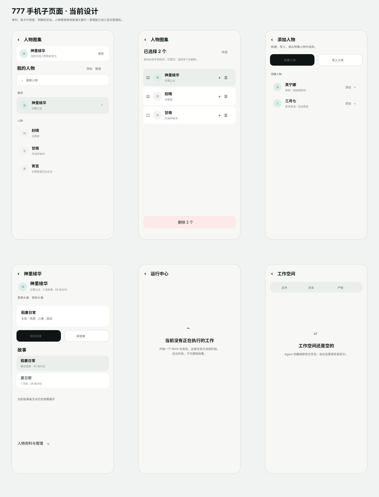

# 手机端 UI 设计

当前 UI 只设计和验收手机布局。此文档与 `docs/UI-UX.zh-CN.md`、当前 Compose 实现共同构成界面事实源。

## 设计板

### 侧边栏



### 子页面



## 当前风格

手机端默认采用 [澄境（Clear Realm）主题](./clear-realm-theme.md)。视觉继续保持轻量方向，同时统一为内容优先、四级 Surface、无衬线 UI、克制 Accent 与状态驱动动效：

- 单色线性图标，24 单位网格、2 单位圆角描边。
- 页面以底色、留白、字体层级组织信息，减少连续白卡和大阴影。
- 只有“当前上下文、当前选中、真正需要分组的内容”形成明确 Surface。
- 管理能力进入管理态或二级页面，默认浏览页不把所有按钮同时摊开。
- 页面切换和结构变化沿用 `DsAnimations`；动画解释状态变化，不做装饰循环。

## 人物图集

默认页按手机单列组织：

```text
当前对话人物（仅有未保存变化时出现）
我的宝贝们 + 添加 / 管理
搜索
置顶
其他人物
```

人物列表使用紧凑头像行。人物头像复用聊天头像链路，列表行最小高度 64dp，不再在首页展示 230dp 立绘卡。

管理态提供：

- 复选框多选。
- 置顶 / 取消置顶。
- 显式拖动手柄。
- 组内自由排序。
- 多选删除与二次确认。

“添加人物”独立为页内二级视图，只承载新建、导入和预置人物；不再长期挤占“我的宝贝们”首页。

预置人物点击“快到碗里来”后保持在当前列表，不进入人物详情；成功后按钮原地显示“已抱走”，便于连续添加。

人物详情默认只展开：

```text
温馨相片框人物展示
当前关系 / 当前故事
继续故事 / 新故事
故事列表
当前故事内容
```

人物相片采用“放在桌上或相册里的照片”语义：图片始终正放，不做 3D 透视、拖拽倾斜、展台底座或大块灰色展览背景；相片按原始横竖比例自适应宽度，使用 `ContentScale.Fit` 完整展示人物。外层只保留轻量纸张感 Surface、圆角和低阴影，人物名与身份作为相片下沿的轻量说明，整体偏温馨、可爱、生活化。

人物图片第一次进入详情时直接按图片方向元数据自动转正，初始位置固定居中；不保留旋转、位移或透视调整状态，也不要求用户手动校正。

已有相片不常驻“更换 / 移除”按钮。长按相片打开操作 Sheet，再选择“更换形象图”或“移除形象图”；没有相片时轻点占位区域直接添加。这样默认详情页只保留浏览与故事主任务，低频图片管理按需出现。

人物完整资料、导出和删除收进“人物资料与管理”。

## 子页面禁止空白

每个独立入口统一覆盖：

```text
Loading → Error → Empty → Content
```

Empty 必须说明“为什么现在没有内容”和“内容会在什么条件下出现”。能够恢复时最多提供一个主动作。

已明确：

- 运行中心：无任务时解释 Work 任务开始后会出现阶段、后台任务、子代理和结果。
- 工作空间：文件、涉及文件、产物、会话文件分别有语义化空状态。
- 角色日记、任务中心继续沿用既有空状态。
- 工具 / 远程等配置型页面即使未连接，也显示当前能力状态和下一步入口，不出现只有标题栏的页面。

## 统一导航

本机功能页统一挂在同一个侧边栏宿主下，不再让 RootOverlay、全屏 Dialog 和页面局部布尔状态分别承担一级导航。

- 主界面和所有一级完整页面都支持沿用侧边栏右划进入。
- 从主界面进入功能页，返回主界面。
- 从功能 A 通过侧边栏进入功能 B，B 返回 A；继续返回时按进入顺序逐层回退。
- 选择具体聊天 / 工作会话时清空功能页栈，直接回到对应会话主界面。
- 工作空间、运行中心按普通完整页面承载，不用全屏 Dialog 截断侧边栏手势。
- 群聊在尚未建立时先选择至少两个角色；确认后才创建群聊会话，取消不改变当前页面和会话。

## 页面承载

手机端持续浏览 / 管理使用完整页面：

- 人物图集与人物详情。
- 角色日记。
- 工作空间。
- 运行中心。
- 任务中心。
- 工具中心。
- 远程控制。
- 设置。

快速选择和一次性局部任务使用 Sheet / Dialog，例如人物快速切换、群成员、模型选择、人物行为调节、审批、Ask User 和高风险确认。


## 全应用触达面精修基准

本轮按“用户能看到、能点到、能滑到、能等待到”的表面逐项检查，不以单个页面截图作为完成标准。公共组件优先收口，页面只保留自身语义。

| 触达面 | 精修基准 | 当前落地 |
|---|---|---|
| 主界面 / 一级功能页 | 进入与返回必须表达层级，保留原页状态 | 本机功能栈统一短位移 + 淡入淡出，返回反向运动 |
| 侧边栏 | Chat / Work 骨架稳定；导航图标同一线性语言 | 本机与远程高频入口统一 Feather 线性图标 |
| 聊天 | 对话、人物、输入是视觉主任务；运行状态不抢正文 | 输入区沿用统一组件，Running 状态只做轻量呼吸反馈 |
| Work | 当前目标、当前步骤、阻塞状态优先 | 当前真实执行步骤图标与状态点有实时反馈，完成 / 失败立即静止 |
| 人物图集 | 浏览优先，管理按需；照片承担人物身份 | 紧凑人物行、生活化相片详情、长按图片操作、独立管理态 |
| 角色日记 | 内容像记录，不像参数面板 | 搜索 / 筛选稳定，加载、失败、空结果统一使用语义状态 |
| 工作空间 | 路径清楚、文件层级清楚、等待内容可解释 | 文件 / 涉及文件 / 产物分段；加载用文件语义状态；错误可重试 |
| 运行中心 | 用户先知道“做到哪一步” | 空态解释出现条件；执行详情按目标、阶段、后台任务和结果组织 |
| 任务中心 | 新建入口清楚，列表以任务状态为主 | 顶部新建入口统一线性图标；编辑仍在原页面层级内返回 |
| 工具中心 | 当前能力和连接状态优先于配置表单 | 首次无数据时显示工具语义加载；已有数据刷新不遮盖内容 |
| 设置 | 分组清楚，返回路径稳定，预览和真实组件一致 | 继续使用统一 TopBar / GroupCard；历史等导航动作统一图标语言 |
| 远程 / 配对 | 设备与连接状态可辨认，失败可恢复 | 中继连接使用设备语义实时状态，失败切换为警示状态并保留返回 |
| Dialog / Sheet / Menu | 一次局部任务、关闭路径明确 | Dialog 遮罩关闭严格遵循参数；Sheet / Menu 继续由公共组件统一 |
| Empty / Error / Loading | 页面不能只剩标题或通用转圈 | 统一视觉锚点；页面级等待必须说明正在等待什么 |
| Toast / 一次性反馈 | 短暂、可重复触发，不污染持久状态 | 继续复用统一 Toast 事件语义 |
| 自定义背景 / 深浅色 | 所有浮层、卡片、导航都继承同一 Surface 规则 | 公共状态组件直接使用 Design System 色与 Surface，不硬编码背景 |

### 动效节奏

动效只解释状态和层级：

| 场景 | 节奏 |
|---|---|
| 点击 / 按压 | 约 100ms，轻微缩放，不弹跳 |
| 图标 / 小状态切换 | 120–160ms |
| 输入区结构变化 | 180–220ms |
| 一级 / 二级页面进退 | 位移约 210ms，透明度约 140ms |
| 当前真实 Running / Loading | 约 900ms 单次呼吸往返，仅状态存续期间循环 |
| Done / Failed | 一次收束后保持静态 |

页面进入时只移动屏宽的一小部分，避免整页“飞入”；返回采用反方向运动，让用户能理解自己从哪一层回来。列表历史项、完成态、失败态不持续运动。

### 图标与触控

- 导航、侧栏、返回、新建、搜索、刷新等高频 Chrome 优先使用项目内 Feather 线性图标。
- 业务内容中没有对应 Feather 语义的图标可以继续使用 Material Outlined；不为形式统一制造错误语义。
- 独立可点击目标继续保证至少 48dp 命中区；视觉图标可以更小。
- 长按操作必须有明确上下文，低频操作不长期占用主页面。
