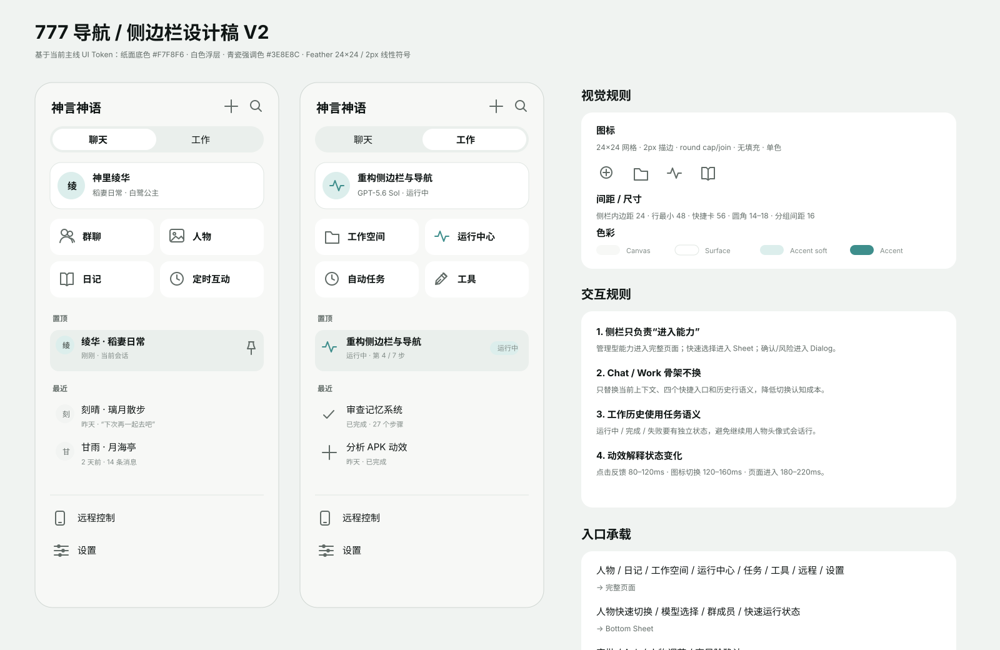
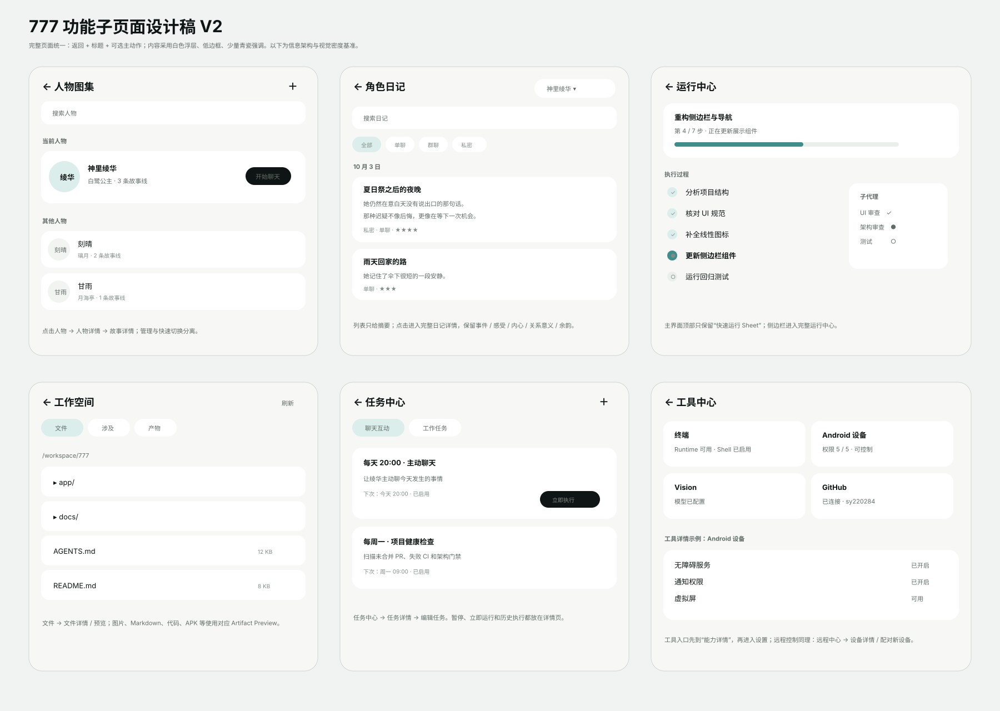

# 777 导航与功能页面设计稿 V2

这份设计稿补齐 Figma 暂时无法写入时的可评审视觉基准。它以当前主线实现和 `docs/UI-UX.zh-CN.md` 为约束，不建立平行设计规范。

## 设计板

### 侧边栏 / 导航



重点：

- Chat / Work 使用同一骨架，只替换上下文、快捷入口与历史行语义。
- 侧栏图标统一为项目内 Feather 风：24×24 网格、2px 圆角描边、无填充、单色。
- Chat 历史使用人物身份；Work 历史使用任务状态。
- “置顶”必须显式分组并显示图钉，不能只做排序。
- 当前上下文卡只负责说明“正在和谁聊 / 正在处理哪个工作”，快速切换能力后续由 Sheet 承担。

### 功能子页面



页面层级统一为：

```text
侧边栏入口
→ 一级完整页面
→ 二级详情
→ 必要时编辑 / 预览
```

## 页面承载规则

| 功能 | 一级承载 | 二级承载 |
|---|---|---|
| 人物 | 人物图集 Page | 人物详情 → 故事详情 |
| 日记 | 日记列表 Page | 日记详情 |
| 工作空间 | Workspace Page | 文件 / Artifact Preview |
| 运行中心 | Run Center Page | 子代理 / 后台任务 / 文件详情 |
| 任务 | Task Center Page | Task Detail → Editor |
| 工具 | Tools Center Page | Tool Detail → 对应设置 |
| 远程控制 | Remote Center Page | Device Detail / Pairing |
| 设置 | Settings Page | 现有 SettingsDestination 子页面 |

快速动作继续使用浮层：

- 人物快速切换、模型选择、群成员、主界面快速运行状态：Bottom Sheet。
- 审批、Ask、人物调节、高风险确认：Dialog。
- 少量附属操作：Popup Menu。
- 瞬时操作结果：Snackbar / Toast。

## 交互动效

| 场景 | 建议 |
|---|---|
| 点击反馈 | 80–120ms |
| 小图标 / 状态切换 | 120–160ms |
| 输入区 / 卡片结构变化 | 180–220ms |
| 页面层级进入 | 180–220ms |
| Sheet | 180–220ms |
| 长任务 Running | 仅当前步骤持续运动 |
| Done / Failed | 一次收束状态动画，随后静态 |

原则：动效解释状态变化，不承担装饰职责。已完成历史条目保持静态。

## 视觉规格

直接继承项目 Design System：

- Canvas：`DsLight.bgBase #F7F8F6`
- Surface：`#FFFFFF`
- Active nav：`Ds.Bluish100 #EAEFEC`
- Accent soft：`Ds.Celadon100 #DCEEEC`
- Accent：`Ds.Celadon600 #3E8E8C`
- Primary text：`Ds.Bluish1000 #0F1514`
- Secondary text：`Ds.Bluish700 #616B67`
- 触控目标：独立目标 ≥ 48dp
- 快捷卡：建议最小高 56dp
- 图标：视觉 20–24dp，命中区仍 ≥ 48dp

## 与当前实现的关系

已落地主线：

- 侧栏稳定骨架。
- Chat / Work 2×2 快捷入口。
- 当前上下文卡。
- 置顶 / 最近分组。
- Work 任务态历史行。
- Feather 线性图标体系。

后续页面改造按这份稿分阶段推进，不把多个大型页面同时堆进 `LocalHarnessScreen`。优先顺序：

```text
Workspace 页面化
→ 运行中心完整页
→ Remote Center
→ 人物图集 / 日记详情层
→ Task Center 三层结构
→ Tool Detail
```

Figma MCP 恢复后，以本稿与当前主线代码共同作为迁移输入；Figma 不应成为另一套独立事实源。
